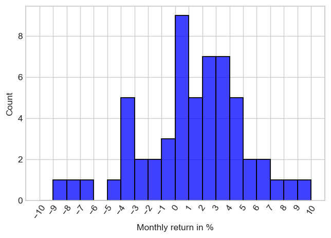
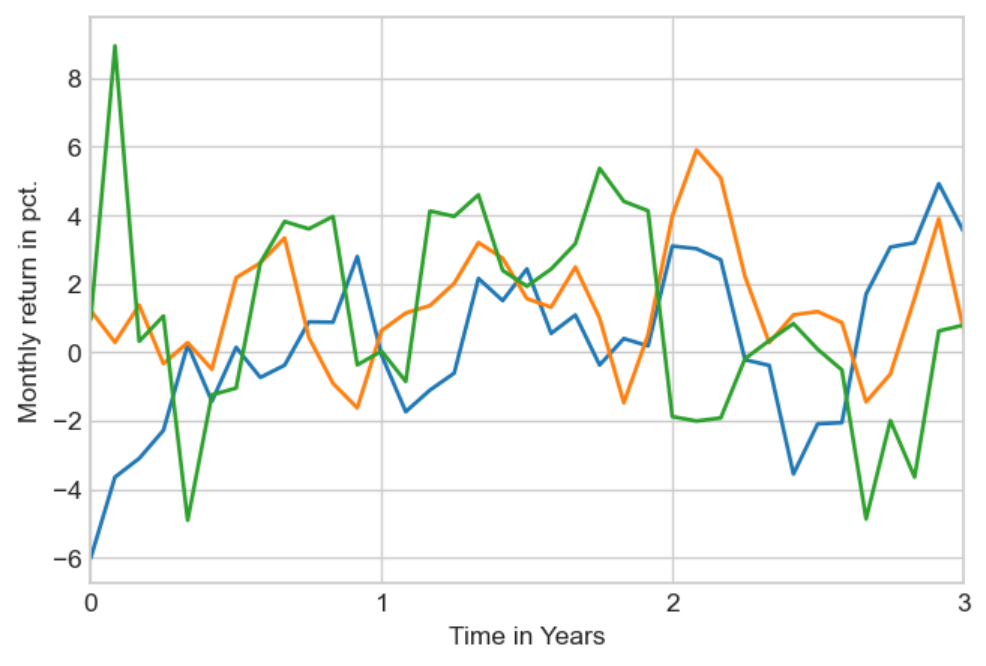
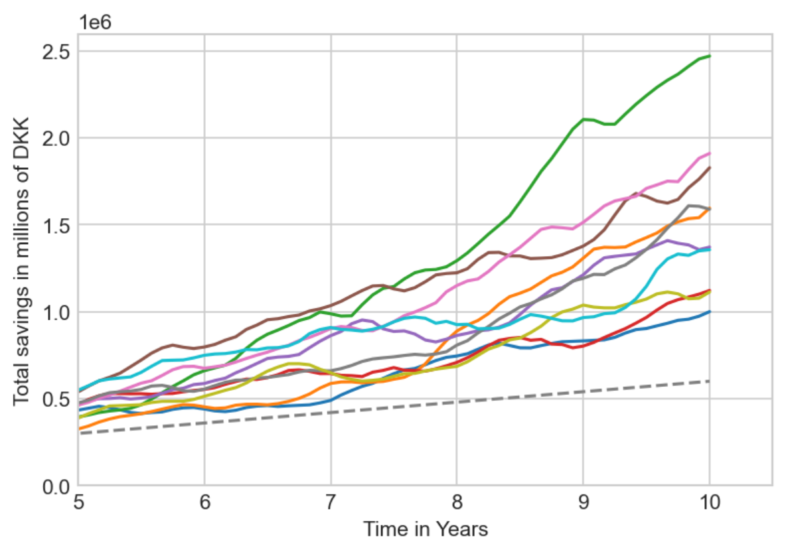
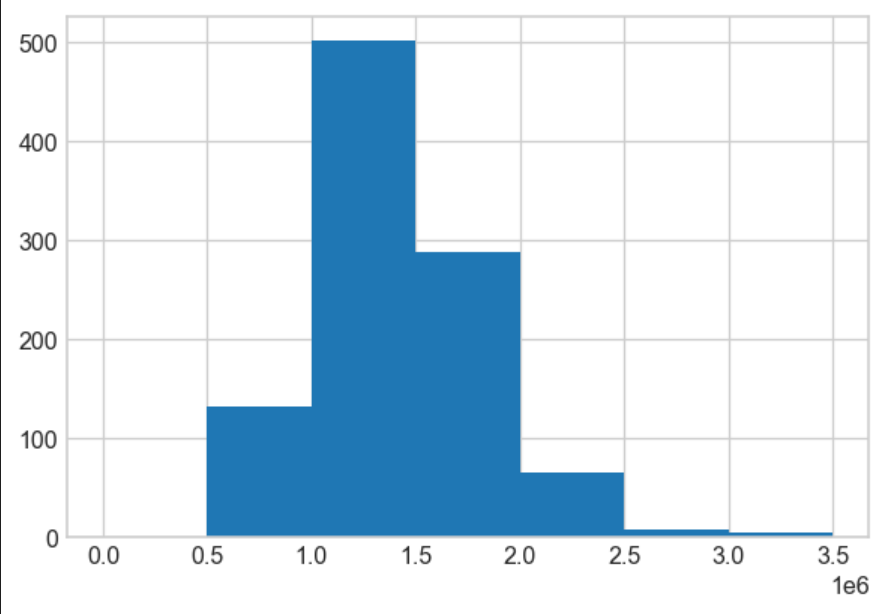

# Getting started

``` bash
python -m venv env
source env/Scripts/Activate
python -m pip install --upgrade pip
python -m pip install --upgrade build
python -m pip install -r requirements.txt 
python -m pip install --editable .
ipython kernel install --user --name=stock-analysis
```

# Analysis










